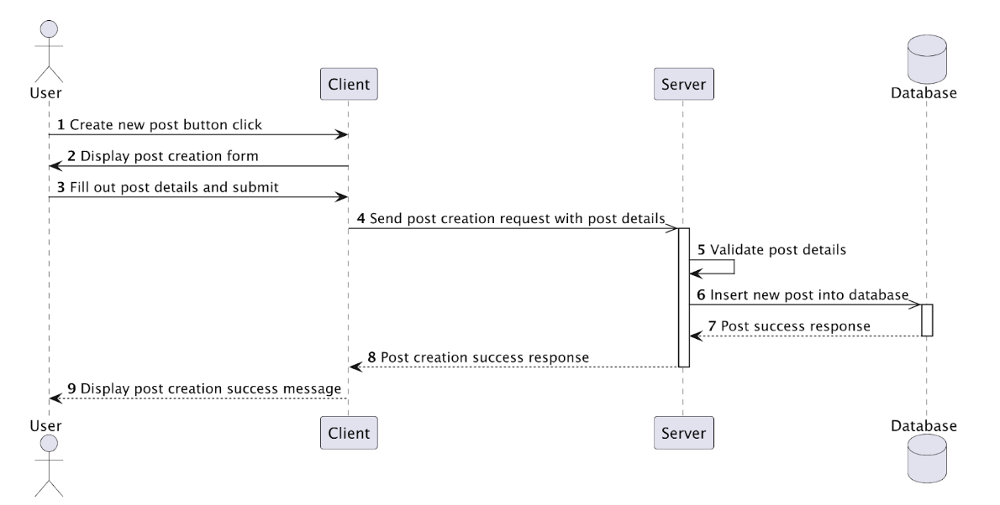
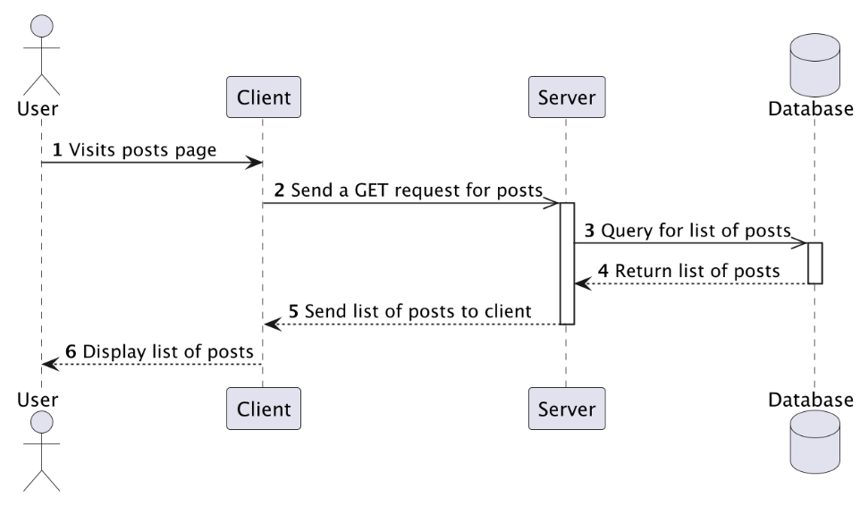
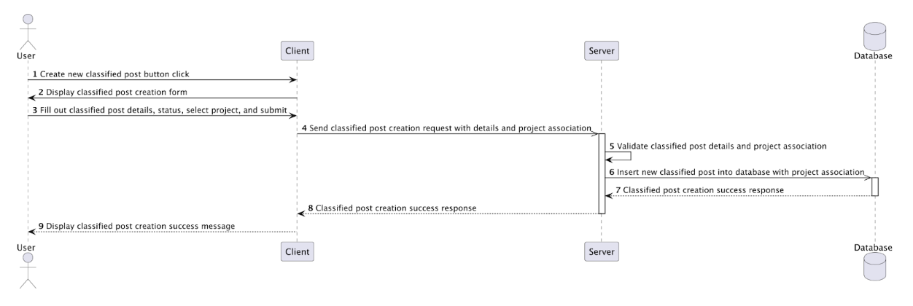

# ConnectHub Service API Documentation

## Overview
The ConnectHub microservice for Hatchloom provides a set of API endpoints 
to manage user posts of different types (share, announcement, achievement),
creating feed actions such as likes and comments, and managing
classified posts which are to be part of the Launchpad service.

## Features
- Create and manage user posts (share, announcement, achievement)
- Create feed actions (like, comment)
- Manage classified posts for Launchpad
- Filtering classified posts status
- Integrate with other services such as User Service and Launchpad
- Future support for pagination for posts

---

## Table of Contents
1. [Feed Post Service](#feed-post-service)
2. [Classified Post Service](#classified-post-service)
3. [Feed Action Service](#feed-action-service)

---

## General Diagram Functionality
**Creating a post**


**Getting posts**


**Creating a classified post**

---

## Feed Post Service

### Overview
The Feed Post Service manages the creation, retrieval, and deletion of user posts in the feed. It supports three types of posts: Share, Announcement, and Achievement.

### Service Methods

#### 1. Create Feed Post
- **Method**: `createFeedPost(PostCreationRequest request)`
- **Description**: Creates a new feed post of a specified type (share, announcement, or achievement)
- **Returns**: `Post` object
- **Validation**:
  - Title must not be null or blank
  - Content must not be null or blank
  - Author ID must not be null
  - Post type must be one of: "share", "announcement", "achievement"

#### 2. Delete Feed Post
- **Method**: `deleteFeedPost(Integer postId, Integer userId)`
- **Description**: Deletes a feed post (only the author can delete their own post)
- **Returns**: void
- **Validation**:
  - Post ID must not be null
  - User ID must not be null
  - Post must exist
  - User must be the author of the post

#### 3. Get All Feed Posts
- **Method**: `getAllFeedPosts()`
- **Description**: Retrieves all feed posts (pagination to be added later)
- **Returns**: `List<Post>`

---

### REST API Endpoints

#### POST `/api/feed`
**Create a new feed post**

**Request Body**:
```json
{
  "basePost": {
    "title": "Post title",
    "content": "Post content",
    "authorId": 1
  },
  "postType": "share"
}
```

**Post Types**: `share`, `announcement`, `achievement`

**Response** (201 Created):
```json
{
  "id": 1,
  "title": "Post title",
  "content": "Post content",
  "author": 1,
  "createdAt": "2026-03-08T10:30:00",
  "postType": "share"
}
```

**Error Response** (400 Bad Request):
```json
null
```

---

#### GET `/api/feed`
**Get all feed posts**

**Response** (200 OK):
```json
[
  {
    "id": 1,
    "title": "Post title",
    "content": "Post content",
    "author": 1,
    "createdAt": "2026-03-08T10:30:00",
    "postType": "share"
  }
]
```

---

#### DELETE `/api/feed/{postId}`
**Delete a feed post**

**Path Parameters**:
- `postId` (Integer) - ID of the post to delete

**Query Parameters**:
- `userId` (Integer) - ID of the user requesting deletion

**Response** (200 OK):
```json
"Post deleted successfully"
```

**Error Response** (400 Bad Request):
```json
"Error message"
```

---

## Classified Post Service

### Overview
The Classified Post Service manages classified posts intended for the Launchpad service. These posts are associated with projects and have status tracking (open, filled, closed).

### Service Methods

#### 1. Create Classified Post
- **Method**: `createClassifiedPost(ClassifiedPostCreationRequest request)`
- **Description**: Creates a new classified post linked to a project
- **Returns**: `ClassifiedPost` object
- **Validation**:
  - Title must not be null or empty (max 255 characters)
  - Content must not be null or empty (max 3000 characters)
  - Author ID must not be null
  - Project ID must not be null and must be positive
  - Status must be one of: "open", "filled", "closed"

#### 2. Get Classified Post by ID
- **Method**: `getClassifiedById(Integer postId)`
- **Description**: Retrieves a specific classified post by its ID
- **Returns**: `ClassifiedPost` object
- **Validation**:
  - Post ID must not be null and must be positive
  - Post must exist

#### 3. Filter Classified Posts by Status
- **Method**: `filterClassifiedPostsByStatus(String status)`
- **Description**: Retrieves all classified posts with the specified status
- **Returns**: `List<ClassifiedPost>`
- **Validation**:
  - Status must be one of: "open", "filled", "closed"

#### 4. Update Classified Post Status
- **Method**: `updateClassifiedPostStatus(Integer postId, Integer userId, String newStatus)`
- **Description**: Updates the status of a classified post (only the author can update)
- **Returns**: `ClassifiedPost` object
- **Validation**:
  - Post ID must not be null
  - User must be the author of the post
  - New status must be one of: "open", "filled", "closed"

#### 5. Get All Classified Posts
- **Method**: `getAllClassifiedPosts()`
- **Description**: Retrieves all classified posts (pagination to be added later)
- **Returns**: `List<ClassifiedPost>`

---

### REST API Endpoints

#### POST `/api/classified`
**Create a new classified post**

**Request Body**:
```json
{
  "basePost": {
    "title": "Seeking Java Developer",
    "content": "Looking for an experienced Java developer for our project",
    "authorId": 1
  },
  "projectId": 5,
  "status": "open"
}
```

**Status Values**: `open`, `filled`, `closed`

**Response** (201 Created):
```json
{
  "id": 1,
  "title": "Seeking Java Developer",
  "content": "Looking for an experienced Java developer for our project",
  "author": 1,
  "projectId": 5,
  "status": "open",
  "createdAt": "2026-03-08T10:30:00",
  "updatedAt": "2026-03-08T10:30:00"
}
```

**Error Response** (400 Bad Request):
```json
null
```

---

#### GET `/api/classified/{postId}`
**Get a specific classified post**

**Path Parameters**:
- `postId` (Integer) - ID of the classified post

**Response** (200 OK):
```json
{
  "id": 1,
  "title": "Seeking Java Developer",
  "content": "Looking for an experienced Java developer for our project",
  "author": 1,
  "projectId": 5,
  "status": "open",
  "createdAt": "2026-03-08T10:30:00",
  "updatedAt": "2026-03-08T10:30:00"
}
```

**Error Response** (400 Bad Request):
```json
null
```

---

#### GET `/api/classified/filtered`
**Get classified posts filtered by status**

**Query Parameters**:
- `statusType` (String) - Status to filter by (`open`, `filled`, or `closed`)

**Response** (200 OK):
```json
[
  {
    "id": 1,
    "title": "Seeking Java Developer",
    "content": "Looking for an experienced Java developer for our project",
    "author": 1,
    "projectId": 5,
    "status": "open",
    "createdAt": "2026-03-08T10:30:00",
    "updatedAt": "2026-03-08T10:30:00"
  }
]
```

**Error Response** (400 Bad Request):
```json
null
```

---

#### PUT `/api/classified/{postId}/status`
**Update the status of a classified post**

**Path Parameters**:
- `postId` (Integer) - ID of the classified post

**Query Parameters**:
- `userId` (Integer) - ID of the user requesting the update
- `newStatus` (String) - New status value (`open`, `filled`, or `closed`)

**Response** (200 OK):
```json
{
  "id": 1,
  "title": "Seeking Java Developer",
  "content": "Looking for an experienced Java developer for our project",
  "author": 1,
  "projectId": 5,
  "status": "filled",
  "createdAt": "2026-03-08T10:30:00",
  "updatedAt": "2026-03-08T11:00:00"
}
```

**Error Response** (400 Bad Request):
```json
null
```

---

## Feed Action Service

### Overview
The Feed Action Service manages interactions with feed posts, including likes and comments. It supports liking posts, commenting on posts, liking comments, and retrieving action statistics.

### Service Methods

#### 1. Like a Post
- **Method**: `likePost(LikeRequest request)`
- **Description**: Adds a like to a post from a specific user
- **Returns**: void
- **Validation**:
  - Post must exist
  - User cannot like the same post twice

#### 2. Unlike a Post
- **Method**: `unlikePost(Integer postId, Integer userId)`
- **Description**: Removes a user's like from a post
- **Returns**: void
- **Validation**:
  - User must have already liked the post

#### 3. Add Comment
- **Method**: `addComment(CommentRequest request)`
- **Description**: Adds a comment to a post
- **Returns**: void
- **Validation**:
  - Post must exist
  - Comment text must not be null or empty

#### 4. Delete Comment
- **Method**: `deleteComment(Integer commentId, Integer userId)`
- **Description**: Deletes a comment (comment author or post author can delete)
- **Returns**: void
- **Validation**:
  - Comment must exist
  - User must be either the comment author or the post author

#### 5. Like a Comment
- **Method**: `likeComment(Integer commentId, Integer userId)`
- **Description**: Adds a like to a specific comment
- **Returns**: `FeedAction` object
- **Validation**:
  - Comment must exist
  - User cannot like the same comment twice

#### 6. Unlike a Comment
- **Method**: `unlikeComment(Integer commentId, Integer userId)`
- **Description**: Removes a user's like from a comment
- **Returns**: void
- **Validation**:
  - User must have already liked the comment

#### 7. Get Post Actions
- **Method**: `getPostActions(Integer postId, Integer currentUserId)`
- **Description**: Retrieves all actions (likes and comments) for a specific post
- **Returns**: `PostActionsResponse` object
- **Validation**:
  - Post must exist

#### 8. Get Comments by Post ID
- **Method**: `getCommentsByPostId(Integer postId)`
- **Description**: Retrieves all comments for a specific post
- **Returns**: `List<CommentResponse>`

#### 9. Get Likes Count
- **Method**: `getLikesCount(Integer postId)`
- **Description**: Gets the number of likes on a post
- **Returns**: `Long`

#### 10. Get Comment Likes Count
- **Method**: `getCommentLikesCount(Integer commentId)`
- **Description**: Gets the number of likes on a comment
- **Returns**: `Long`

---

### REST API Endpoints

#### POST `/api/feed/actions/like`
**Like a post**

**Request Body**:
```json
{
  "userId": 1,
  "postId": 5
}
```

**Response** (201 Created):
```json
"Post liked successfully"
```

**Error Response** (400 Bad Request):
```json
"Error message"
```

---

#### DELETE `/api/feed/actions/like`
**Unlike a post**

**Query Parameters**:
- `postId` (Integer) - ID of the post
- `userId` (Integer) - ID of the user

**Response** (200 OK):
```json
"Post unliked successfully"
```

**Error Response** (400 Bad Request):
```json
"Error message"
```

---

#### POST `/api/feed/actions/comment`
**Add a comment to a post**

**Request Body**:
```json
{
  "userId": 1,
  "postId": 5,
  "commentText": "Great post!"
}
```

**Response** (201 Created):
```json
"Comment added successfully"
```

**Error Response** (400 Bad Request):
```json
"Error message"
```

---

#### DELETE `/api/feed/actions/comment/{commentId}`
**Delete a comment**

**Path Parameters**:
- `commentId` (Integer) - ID of the comment

**Query Parameters**:
- `userId` (Integer) - ID of the user requesting deletion

**Response** (200 OK):
```json
"Comment deleted successfully"
```

**Error Response** (400 Bad Request):
```json
"Error message"
```

---

#### GET `/api/feed/actions/post/{postId}`
**Get all actions for a post (likes, comments, etc.)**

**Path Parameters**:
- `postId` (Integer) - ID of the post

**Query Parameters**:
- `userId` (Integer, optional) - ID of the current user (to check if they liked the post)

**Response** (200 OK):
```json
{
  "postId": 5,
  "likesCount": 10,
  "commentsCount": 3,
  "comments": [
    {
      "id": 1,
      "postId": 5,
      "userId": 2,
      "commentText": "Great post!",
      "createdAt": "2026-03-08T10:30:00"
    }
  ],
  "isLikedByCurrentUser": true
}
```

**Error Response** (400 Bad Request):
```json
"Error message"
```

---

#### GET `/api/feed/actions/post/{postId}/comments`
**Get all comments for a post**

**Path Parameters**:
- `postId` (Integer) - ID of the post

**Response** (200 OK):
```json
[
  {
    "id": 1,
    "postId": 5,
    "userId": 2,
    "commentText": "Great post!",
    "createdAt": "2026-03-08T10:30:00"
  }
]
```

**Error Response** (400 Bad Request):
```json
"Error message"
```

---

#### GET `/api/feed/actions/post/{postId}/likes/count`
**Get the number of likes on a post**

**Path Parameters**:
- `postId` (Integer) - ID of the post

**Response** (200 OK):
```json
10
```

**Error Response** (400 Bad Request):
```json
"Error message"
```

---

#### POST `/api/feed/actions/comment/{commentId}/like`
**Like a comment**

**Path Parameters**:
- `commentId` (Integer) - ID of the comment

**Query Parameters**:
- `userId` (Integer) - ID of the user

**Response** (201 Created):
```json
{
  "id": 15,
  "postId": 5,
  "userId": 1,
  "actionType": "like",
  "commentText": null,
  "parentActionId": 10,
  "createdAt": "2026-03-08T10:30:00"
}
```

**Error Response** (400 Bad Request):
```json
"Error message"
```

---

#### DELETE `/api/feed/actions/comment/{commentId}/like`
**Unlike a comment**

**Path Parameters**:
- `commentId` (Integer) - ID of the comment

**Query Parameters**:
- `userId` (Integer) - ID of the user

**Response** (200 OK):
```json
"Comment unliked successfully"
```

**Error Response** (400 Bad Request):
```json
"Error message"
```

---

#### GET `/api/feed/actions/comment/{commentId}/likes/count`
**Get the number of likes on a comment**

**Path Parameters**:
- `commentId` (Integer) - ID of the comment

**Response** (200 OK):
```json
5
```

**Error Response** (400 Bad Request):
```json
"Error message"
```

---